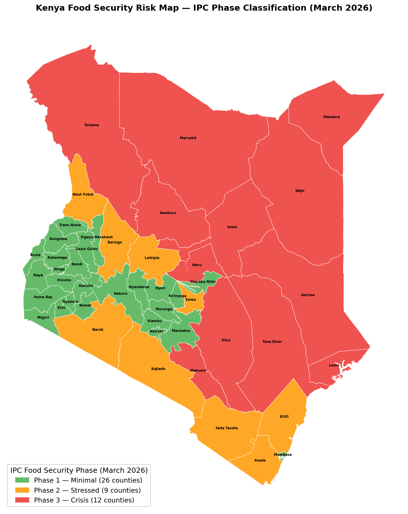
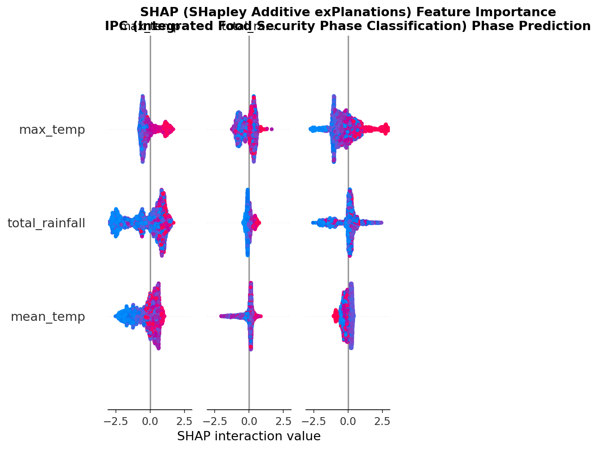
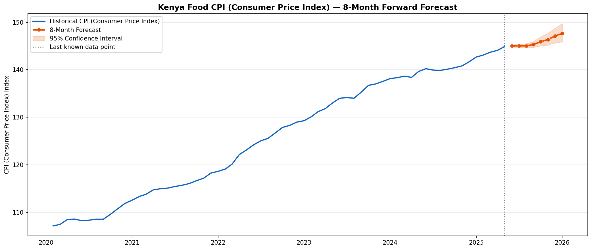
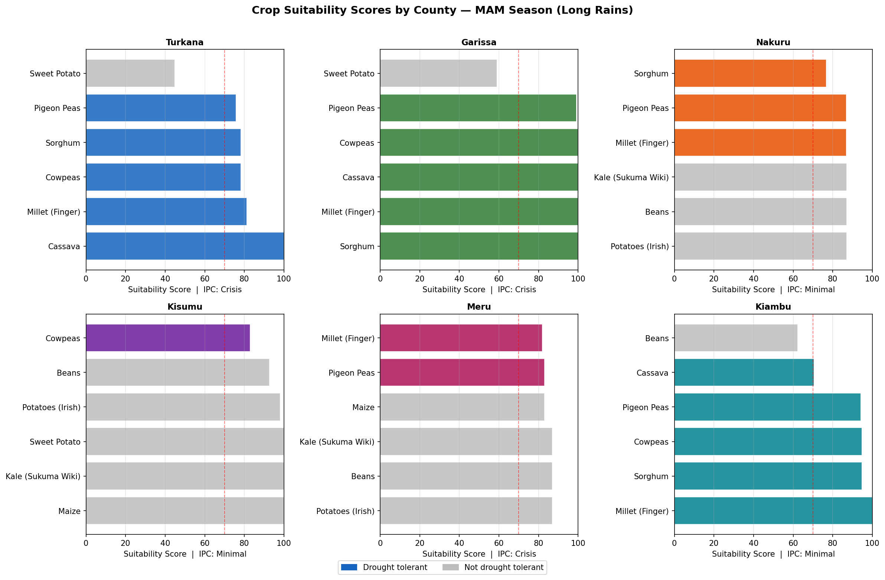
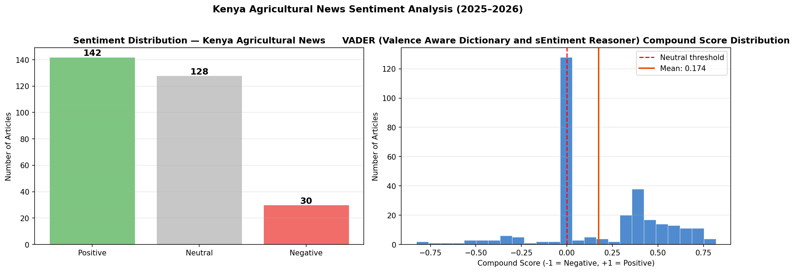

<div align="center">


<h1>Kenya Smart Agriculture & Market Intelligence Platform</h1>

<p><em>Using NASA satellite weather data to predict food security risk, forecast food prices,<br>and recommend crops to farmers across all 47 counties in Kenya</em></p>

<br>

[](https://kenya-smart-agriculture.streamlit.app)
[](https://public.tableau.com/app/profile/eve.michelle/viz/KenyaSmartAgricultureMarketIntelligenceDashboard/Dashboard1)
[](https://github.com/EveMichelle/kenya-smart-agriculture)

<br>


<br>

**Built by [Eve Otieno](https://github.com/EveMichelle)** — Data Scientist, Nairobi, Kenya 🇰🇪

</div>

---

## Overview

An end-to-end machine learning platform that identifies food security risk, forecasts food prices, recommends crops to farmers, and analyses agricultural news sentiment across all 47 counties in Kenya — using NASA satellite weather data as the primary signal.

Kenya's food security problem is not caused by a lack of data. NASA has recorded daily weather for every county since 2000. FEWS NET has classified food security phases since 2009. KNBS has collected market prices monthly. WFP monitors prices across 226 markets. None of this data had ever been merged and used predictively at scale. This project does exactly that.

---

## The Problem

| Problem | Impact |
|---|---|
| Food security phases assessed manually and quarterly | Emergency response arrives after the crisis has peaked |
| Rainfall deficits drive price spikes 2–3 months later but no one connects the data | Farmers and traders get blindsided by price shocks |
| Hundreds of agricultural news articles published weekly, never synthesised | Policy makers miss early warning signals |

---

## Four Integrated ML Modules

| Module | Model | Metric | Score | Target |
|---|---|---|---|---|
| Food Security Classification | XGBoost | Weighted F1 | **0.738** | > 0.70 ✅ |
| Price Forecasting | Facebook Prophet | MAPE | **0.81%** | < 15% ✅ |
| Crop & Market Recommendation | NASA + WFP | Coverage | **10 crops × 226 markets** | All 47 counties ✅ |
| NLP Sentiment Analysis | VADER + TF-IDF | Positive % | **47.3%** | Baseline ✅ |

---

## Kenya Food Security Risk Map — IPC Phase by County (March 2026)



12 counties are in IPC Phase 3 Crisis as of March 2026 — all concentrated in Kenya's northern arid and semi-arid zones. Turkana, Garissa, Wajir, Mandera, and Marsabit are the highest priority counties for intervention.

---

## SHAP Feature Importance — Food Security Classifier



NASA SPI-3 (Standardised Precipitation Index), maximum temperature, and total rainfall are the three strongest predictors of IPC food security phase. This validates the core project hypothesis — NASA weather data alone is sufficient to automate the classification that FEWS NET analysts do manually.

---

## Food Price Forecast — Prophet 8-Month Forward Projection



Kenya's Consumer Price Index has risen 35% since 2020 (107 → 144). The Prophet model forecasts CPI reaching 147.67 by January 2026. MAPE = 0.81% on a 12-month holdout — 18 times better than the 15% target.

---

## Crop Suitability by County



The recommendation system scores 10 crops across all 47 counties using NASA rainfall and temperature data. Drought-prone northern counties receive drought-tolerant crops (cassava, sorghum, millet). Highland counties receive high-value crops (potatoes, beans, kale). WFP market prices are integrated so farmers see current KES/kg alongside suitability scores.

---

## News Sentiment Distribution



300 Kenya News Agency agricultural headlines were scored using VADER. 47.3% positive, 42.7% neutral, 10% negative. Mean score = 0.174 — Kenya agricultural news leans positive overall. Government Programmes carries the highest positive sentiment (0.42). Dairy & Macadamia carries the lowest (0.11), driven by the macadamia export ban controversy.

---

## Key Findings

| Finding | Recommendation |
|---|---|
| 12 counties in Phase 3 Crisis (March 2026) | Prioritise Turkana, Garissa, Wajir, Mandera, Marsabit for immediate intervention |
| NASA SPI-3 is the strongest predictor of food insecurity | Deploy automated monthly drought alerts when SPI-3 drops below -1.0 |
| 2–3 month lag between rainfall deficit and price spikes | Pre-position food stocks when SPI-3 drops below -0.5 |
| Kenya CPI rose 35% from 2020 to 2025 | Prophet forecasts CPI reaching 148 by January 2026 |
| Negative news sentiment spikes precede IPC assessments | Use news sentiment as early warning signal for field verification |

---

## Data Sources

All 5 datasets are raw and non-curated.

| Dataset | Source | Records | Period |
|---|---|---|---|
| NASA POWER Weather | [power.larc.nasa.gov](https://power.larc.nasa.gov) | 409,811 rows | 2000–2023 |
| FEWS NET IPC | [fews.net](https://fews.net/data/acute-food-insecurity) | 640 rows | Mar 2026 |
| KNBS CPI Reports | [knbs.or.ke](https://www.knbs.or.ke/cpi-and-inflation-rates/) | 37 PDFs → 64 records | 2020–2025 |
| WFP Food Prices | [WFP VAM](https://dataviz.vam.wfp.org/economic/prices) | 19,005 rows, 226 markets | 2006–2026 |
| Kenya Agri News | [kenyanews.go.ke](https://www.kenyanews.go.ke/category/agri/) | 300 articles | 2025–2026 |

---

## Project Structure

```
kenya-smart-agriculture/
├── app/
│   ├── streamlit_app.py            # 5-page deployed web application
│   ├── trigger_alerts.py           # Drought + food crisis alert system
│   └── trigger_predictions.py      # Generate fresh county predictions
├── data/
│   ├── raw/                        # All 5 raw datasets
│   └── processed/                  # 9 cleaned and merged files
├── notebooks/
│   ├── 01_data_collection.ipynb
│   ├── 02_data_cleaning.ipynb
│   ├── 03_eda.ipynb
│   ├── 04_food_security_classification.ipynb
│   ├── 05_price_forecasting.ipynb
│   ├── 06_recommendation.ipynb
│   ├── 07_nlp_sentiment.ipynb
│   └── 08_results.ipynb
├── scripts/
│   ├── fetch_nasa.py
│   ├── scrape_news.py
│   ├── train_food_security.py
│   ├── train_price_forecast.py
│   └── train_recommendation.py
├── src/                            # 14 reusable Python modules
├── figures/                        # 24 saved visualisations
├── models/saved/                   # Trained XGBoost .pkl files
├── tableau/                        # 5 Tableau dashboard CSV files
├── constants.py
├── main.py
└── requirements.txt
```

---

## Quick Start

```bash
git clone https://github.com/EveMichelle/kenya-smart-agriculture.git
cd kenya-smart-agriculture
conda create -n kenya-agri python=3.9
conda activate kenya-agri
pip install -r requirements.txt
python main.py
python -m streamlit run app/streamlit_app.py
```

---

## Stakeholders

| Stakeholder | How They Use This |
|---|---|
| County Agricultural Officers | Monthly drought risk scores + IPC predictions per county |
| WFP Kenya and NGOs | Pre-position food stocks 2–3 months before price spikes |
| Smallholder Farmers | Which crops to plant and which markets offer best prices |
| Kenya Ministry of Agriculture | National food security trend monitoring |
| KALRO | Weather-yield correlations for crop advisory updates |

---

## Acknowledgments

- NASA Langley Research Center — POWER API (public domain)
- Famine Early Warning Systems Network (FEWS NET)
- Kenya National Bureau of Statistics (KNBS)
- World Food Programme (WFP)
- Kenya News Agency

---

<div align="center">

MIT License © 2026 Eve Otieno

[⭐ Star this repo](https://github.com/EveMichelle/kenya-smart-agriculture) | [🐛 Report an issue](https://github.com/EveMichelle/kenya-smart-agriculture/issues)

</div>